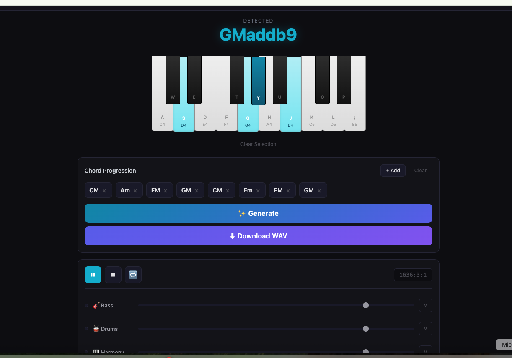

# 🎹 Conductr — AI Music Arranger

**English** | [中文](#中文)

> **You play chords. AI creates music.** ✨

An innovative real-time music composition tool that transforms your MIDI chord input into complete multi-track arrangements using Claude AI.

## 🎯 What is Conductr?

Conductr breaks down the barriers between musical ideas and professional arrangements. Play chord progressions on any MIDI controller or virtual keyboard, and Claude AI instantly generates a full 4-track arrangement with:

- 🎸 **Bass** - Dynamic foundation
- 🥁 **Drums** - Groove and timing
- 🎹 **Harmony** - Harmonic fullness
- 🎵 **Melody** - Emotional texture

### The Workflow

```
Your MIDI Input (Chords)
        ↓
AI Listens & Understands
        ↓
Generates 4-Track Arrangement
        ↓
Real-time Playback + WAV Export
```

## 📸 See It In Action



The interface shows:
- **Virtual Piano Keyboard** - Click keys or use your MIDI controller to play chords
- **Chord Detection** - Automatically recognizes the chords you're playing (CMaddb9, Am, FM, etc.)
- **Chord Progression** - Build a sequence of chords for your arrangement
- **Generate Button** - AI creates a 4-track arrangement
- **Download WAV** - Export your creation as audio
- **Mixer** - Control volume and mute individual tracks (Bass, Drums, Harmony, Melody)
- **Transport Controls** - Play, pause, and loop your arrangement

## ✨ Key Features

✅ **Real-time Music Generation** - Instant AI-powered arrangements as you play
✅ **4-Track Output** - Bass, Drums, Harmony, and Melody in perfect harmony
✅ **Style Control** - Pop, Jazz, Classical, Rock, Electronic, and more
✅ **Interactive UI** - Virtual piano keyboard + chord progression builder
✅ **WAV Export** - Download your creations as professional audio files
✅ **Customizable** - Adjust BPM, key, and instrument volumes
✅ **Browser-Based** - No installation required, runs entirely in your browser

## 🚀 Quick Start

### Prerequisites
- Modern web browser (Chrome, Firefox, Safari, Edge)
- A MIDI controller (optional - virtual keyboard included)
- Claude API credentials (get at [Anthropic Console](https://console.anthropic.com))

### Running Conductr

```bash
# Navigate to project directory
cd conductr

# Start a local web server
python3 -m http.server 8080

# Open in browser at http://localhost:8080
```

### Configure API Settings

1. Click the **⚙️ Settings** button (top-right)
2. Enter:
   - **API Endpoint** - `https://api.anthropic.com/v1/chat/completions`
   - **API Key** - Your Claude API key from https://console.anthropic.com
   - **Model** - `claude-opus-4-6` (or your preferred Claude model)
3. Click **Save**

### Create Your First Arrangement

1. **Build a chord progression:**
   - Click piano keys to select notes (click again to deselect)
   - Watch the "Detected" display show your chord
   - Press **Enter** or click **+ Add** to add it to progression
   - Build multiple chords for longer arrangements

2. **Generate:**
   - Select a **Style** (Pop, Jazz, Classical, etc.)
   - Adjust **BPM** and **Key** if desired
   - Click **✨ Generate**

3. **Play & Export:**
   - Use **▶ Play** to hear your arrangement
   - Adjust track volumes with the mixer
   - Click **⬇ Download WAV** to export as audio file

## 🎮 MIDI Controller Support

Conductr works with standard MIDI controllers:
- **Note input** - Play notes to detect chords
- **Chord detection** - Automatically recognizes chords
- **Real-time feedback** - Instant audio preview

No MIDI controller? The virtual keyboard works perfectly!

## 🏗️ Project Architecture

```
conductr/
├── index.html              # Main UI
├── css/
│   └── style.css          # Styling
├── js/
│   ├── app.js             # Main controller
│   ├── piano-keyboard.js  # Virtual keyboard & MIDI
│   ├── chord-engine.js    # Chord detection
│   ├── ai-arranger.js     # Claude AI integration
│   ├── playback-engine.js # Audio playback & WAV rendering
│   ├── config.js          # Configuration
│   └── utils.js           # Utilities
├── screenshots/
│   └── demo.png           # Demo screenshot
└── README.md
```

## ⚙️ Configuration

### Available Styles
Pop, Jazz, Classical, Electronic, Lo-Fi, Rock, R&B, Bossa Nova

### Supported Keys
All 12 chromatic keys: C, C#, D, D#, E, F, F#, G, G#, A, A#, B

### BPM Range
60 - 200 BPM (adjustable in real-time)

## 🛠️ Development

### No Build Step Required
- Pure JavaScript (ES Modules)
- Vanilla Web Audio via Tone.js
- Edit files and reload browser - that's it!

### Making Changes
1. Edit files in `js/` or `css/`
2. Reload browser
3. Check console for errors

## 📄 License

MIT License - See LICENSE file for details.

Original concept by **Asep Bagja Priandana** (Anthropic Hackathon 2026)
Opened to community for collaborative development.

## 🤝 Contributing

Contributions welcome! See [CONTRIBUTING.md](./CONTRIBUTING.md)

## ❓ FAQ

**Q: Do I need a MIDI controller?**
A: No! Virtual keyboard works great.

**Q: What if API calls fail?**
A: Check API key, endpoint, and model in Settings.

**Q: Can I use this commercially?**
A: Yes! MIT license allows commercial use.

**Q: Does it work offline?**
A: No - requires API connectivity.

## 📞 Support

- Open an issue on GitHub
- Check existing discussions
- Review code comments for technical details

---

**Start composing with Conductr today! 🎹✨**

---

---

# 中文

# 🎹 Conductr — AI音乐编排工具

> **你弹和弦，AI来作曲。** ✨

一款创新的实时音乐创作工具，将你在MIDI控制器上弹奏的和弦转换成完整的多轨编排，由Claude AI强力驱动。

## 🎯 什么是Conductr？

Conductr打破了音乐创意和专业编排之间的壁垒。在MIDI控制器或虚拟键盘上弹奏和弦进行，Claude AI会立即生成完整的四轨编排：

- 🎸 **贝斯** - 动态基础
- 🥁 **鼓组** - 节奏和力度
- 🎹 **和声** - 和声厚度
- 🎵 **旋律** - 情感层次

### 工作流程

```
你的MIDI输入（和弦）
        ↓
AI聆听和理解
        ↓
生成四轨编排
        ↓
实时播放 + WAV导出
```

## 📸 效果展示


界面展示：
- **虚拟钢琴键盘** - 点击键盘或使用MIDI控制器弹奏和弦
- **和弦检测** - 自动识别你弹奏的和弦（CMaddb9、Am、FM等）
- **和弦进行** - 为你的编排构建和弦序列
- **生成按钮** - AI创建四轨编排
- **下载WAV** - 导出你的创作为音频文件
- **混音器** - 控制各轨道的音量和静音（贝斯、鼓、和声、旋律）
- **播放控制** - 播放、暂停和循环你的编排

## ✨ 主要特性

✅ **实时音乐生成** - 随时生成AI动力编排
✅ **四轨输出** - 贝斯、鼓、和声、旋律完美协和
✅ **风格控制** - 流行、爵士、古典、摇滚、电子等
✅ **交互式UI** - 虚拟钢琴键盘 + 和弦进行构建器
✅ **WAV导出** - 下载为专业级音频文件
✅ **可定制** - 调整BPM、调性、轨道音量
✅ **浏览器应用** - 无需安装，直接在浏览器中运行

## 🚀 快速开始

### 前置要求
- 现代浏览器（Chrome、Firefox、Safari、Edge）
- MIDI控制器（可选 - 包含虚拟键盘）
- Claude API凭证（从 [Anthropic Console](https://console.anthropic.com) 获取）

### 运行Conductr

```bash
# 进入项目目录
cd conductr

# 启动本地服务器
python3 -m http.server 8080

# 在浏览器打开 http://localhost:8080
```

### 配置API设置

1. 点击右上角的 **⚙️ 设置** 按钮
2. 输入：
   - **API端点** - `https://api.anthropic.com/v1/chat/completions`
   - **API密钥** - 你的Claude API密钥（来自 https://console.anthropic.com）
   - **模型** - `claude-opus-4-6` （或你喜欢的Claude模型）
3. 点击 **保存**

### 创建你的第一个编排

1. **构建和弦进行：**
   - 点击钢琴键选择音符（再次点击取消选择）
   - 在"检测到"区域看到你的和弦
   - 按 **Enter** 或点击 **+ Add** 添加到进行中
   - 构建多个和弦以获得更长的编排

2. **生成：**
   - 选择一个 **风格**（流行、爵士、古典等）
   - 如需调整 **BPM** 和 **调性**
   - 点击 **✨ 生成**

3. **播放和导出：**
   - 使用 **▶ 播放** 听你的编排
   - 用混音器调整轨道音量
   - 点击 **⬇ 下载WAV** 导出为音频文件

## 🎮 MIDI控制器支持

Conductr支持标准MIDI控制器：
- **音符输入** - 弹奏音符以检测和弦
- **和弦识别** - 自动识别和弦
- **实时反馈** - 即时音频预览

没有MIDI控制器？虚拟键盘完美可用！

## 🏗️ 项目结构

```
conductr/
├── index.html              # 主UI
├── css/
│   └── style.css          # 样式表
├── js/
│   ├── app.js             # 主控制器
│   ├── piano-keyboard.js  # 虚拟键盘和MIDI
│   ├── chord-engine.js    # 和弦检测
│   ├── ai-arranger.js     # Claude AI集成
│   ├── playback-engine.js # 音频播放和WAV渲染
│   ├── config.js          # 配置
│   └── utils.js           # 工具函数
├── screenshots/
│   └── demo.png           # 演示截图
└── README.md
```

## ⚙️ 配置

### 可用风格
流行、爵士、古典、电子、低保真、摇滚、R&B、波萨诺瓦

### 支持的调性
所有12个半音调：C、C#、D、D#、E、F、F#、G、G#、A、A#、B

### BPM范围
60 - 200 BPM（可实时调整）

## 🛠️ 开发

### 无需构建步骤
- 纯JavaScript（ES模块）
- 原生Web Audio（通过Tone.js）
- 编辑文件并刷新浏览器 - 就这么简单！

### 进行更改
1. 编辑 `js/` 或 `css/` 中的文件
2. 刷新浏览器
3. 检查控制台是否有错误

## 📄 许可证

MIT许可证 - 详见LICENSE文件

原创概念由 **Asep Bagja Priandana** 创作（Anthropic黑客马拉松2026）
开源供社区协作开发。

## 🤝 贡献

欢迎贡献！查看 [CONTRIBUTING.md](./CONTRIBUTING.md)

## ❓ 常见问题

**问：我需要MIDI控制器吗？**
答：不需要！虚拟键盘效果很好。

**问：API调用失败怎么办？**
答：检查设置中的API密钥、端点和模型。

**问：我可以商用吗？**
答：可以！MIT许可证允许商业使用。

**问：离线可以用吗？**
答：不行 - 需要API连接。

## 📞 支持

- 在GitHub上提Issue
- 查看现有讨论
- 查看代码注释了解技术细节

---

**今天就开始用Conductr作曲吧！🎹✨**

